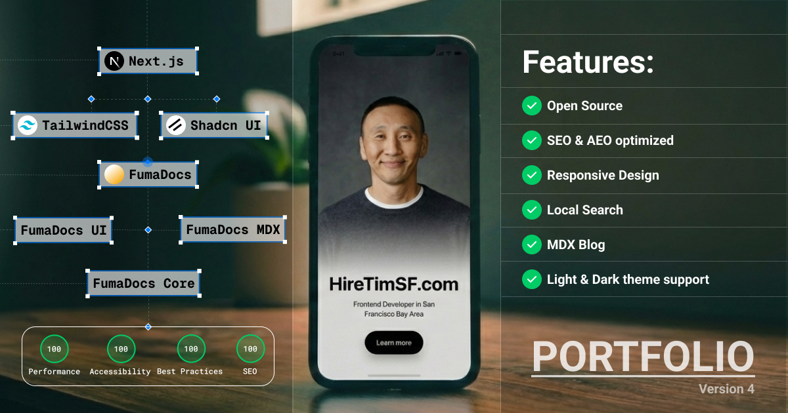
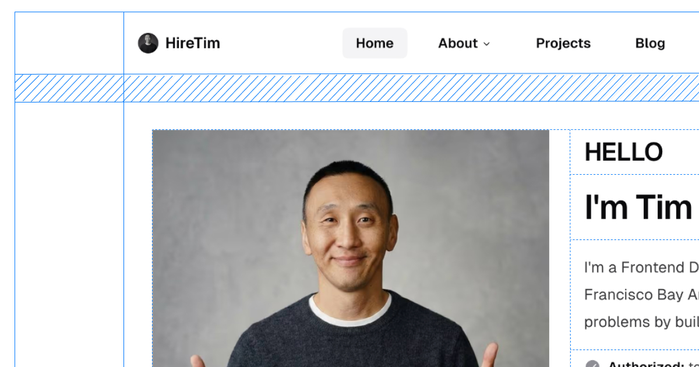
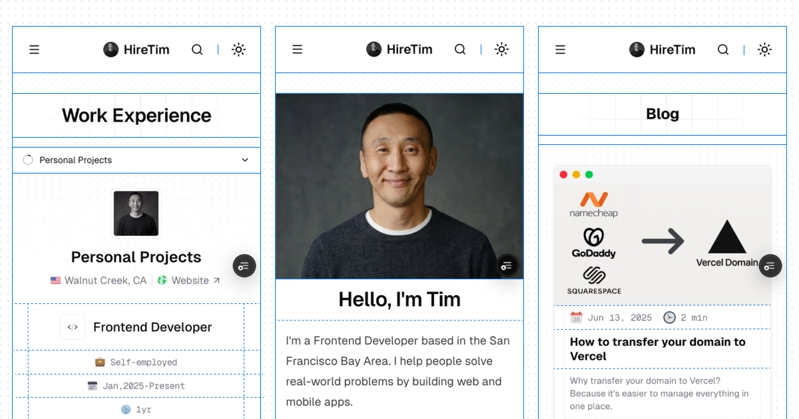
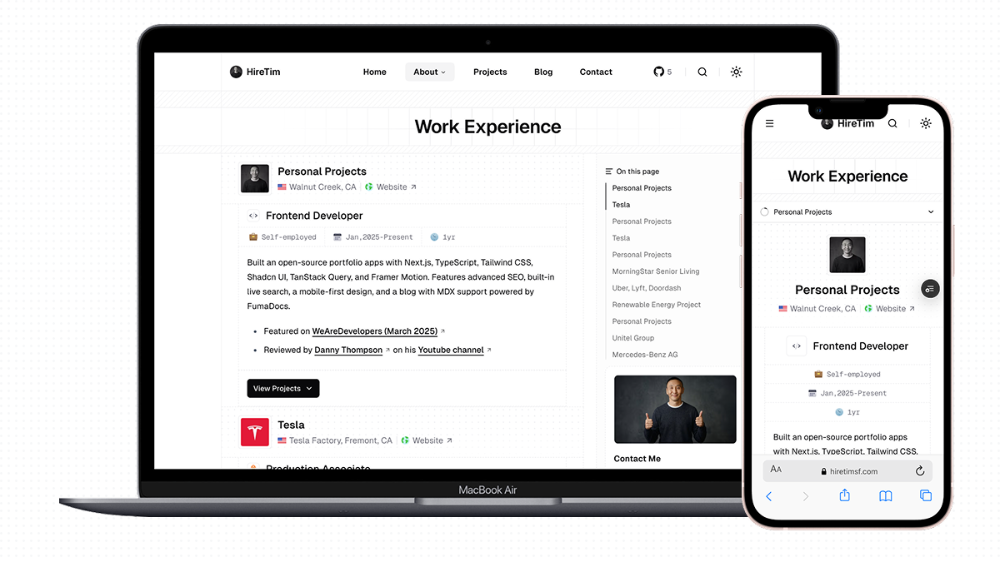
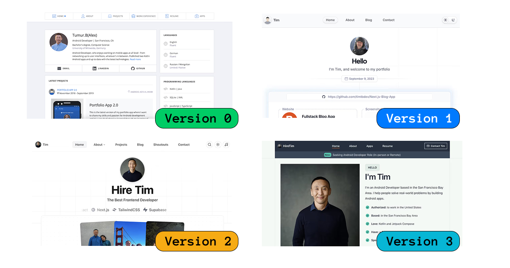

# HireTimSF.com - Portfolio V4

<div align="center">
  
  
  <br />

[](https://nextjs.org/)
[](https://tailwindcss.com/)
[](https://www.typescriptlang.org/)
[](./LICENSE)

  <br />

  <h3>
    <a href="https://hiretimsf.com">🌐 Live Demo</a>
    <span> | </span>
    <a href="#-getting-started">🚀 Getting Started</a>
  </h3>
</div>

<br />

A minimal, high-performance portfolio and blog built with **Next.js 16 (App Router)**, **Tailwind CSS v4**, and **Shadcn UI**. It showcases my work as a Frontend Developer, featuring a clean design, dark mode support, and a fully functional MDX blog.

---

## 📸 Project Previews

### Desktop & Mobile

<div align="center">
  
  <br /><br />
  
</div>

### Responsive Design

<div align="center">
  
</div>

---

## 🛠️ Tech Stack

Built with the latest web technologies for optimal performance and developer experience.

| Category       | Technology                                                   | Description                                     |
| -------------- | ------------------------------------------------------------ | ----------------------------------------------- |
| **Framework**  | [Next.js 16](https://nextjs.org/)                            | App Router, Turbopack, Server Components        |
| **Styling**    | [Tailwind CSS v4](https://tailwindcss.com/)                  | Utility-first CSS framework                     |
| **UI Library** | [shadcn/ui](https://ui.shadcn.com/)                          | Accessible & customizable components            |
| **Animation**  | [Motion](https://motion.dev/)                                | Declarative animations (formerly Framer Motion) |
| **Content**    | [Fumadocs](https://fumadocs.dev/)                            | MDX-based content management                    |
| **State**      | [Nuqs](https://nuqs.47ng.com/) & [Jotai](https://jotai.org/) | URL state & atomic state management             |
| **Analytics**  | [PostHog](https://posthog.com/)                              | Product analytics & insights                    |
| **Deployment** | [Vercel](https://vercel.com/)                                | Edge network deployment                         |

---

## ✨ Key Features

- **🎨 Modern Aesthetic**: Minimalist design with a focus on typography and whitespace.
- **🌗 Dark Mode**: Seamless theme switching with system preference detection.
- **⚡ High Performance**: Optimized Core Web Vitals, fast LCP/FCP using Next.js 16.
- **📝 MDX Blog**: Write content in Markdown/MDX with syntax highlighting and custom components.
- **🔎 Smart Search**: Client-side fuzzy search with keyword highlighting.
- **📱 Responsive**: Fluid layouts that adapt perfectly to mobile, tablet, and desktop.
- **🔍 SEO Ready**: JSON-LD schema, dynamic sitemap, robots.txt, and Open Graph tags.

---

## 🚀 Getting Started

Follow these steps to run the project locally.

### Prerequisites

- **Node.js** 20+ installed
- **npm** or **pnpm** (recommended)

### Installation

1. **Clone the repository**

   ```bash
   git clone https://github.com/hiretimsf/hiretimsf.com.git
   cd hiretimsf.com
   ```

2. **Install dependencies**

   ```bash
   npm install
   # or
   pnpm install
   ```

3. **Configure Environment**

   Copy the template to create your local environment file:

   ```bash
   cp env.template .env.local
   ```

   Open `.env.local` and add your API keys (e.g., Resend, PostHog).

4. **Start the Development Server**
   ```bash
   npm run dev
   ```
   The site should be live at [http://localhost:3000](http://localhost:3000) (or the port shown in your terminal).

### Available Scripts

| Command                | Description                                  |
| :--------------------- | :------------------------------------------- |
| `npm run dev`          | Starts the development server with Turbopack |
| `npm run build`        | Builds the application for production        |
| `npm run start`        | Starts the production server                 |
| `npm run lint`         | Runs ESLint checks                           |
| `npm run format:write` | Formats code using Prettier                  |
| `npm run validate-seo` | Validates SEO configuration                  |

---

## 🏗️ Project Structure

A quick look at the top-level directory structure:

```
hiretimsf.com/
├── actions/        # Server actions for mutations/data
├── app/            # Next.js App Router (pages & layouts)
├── components/     # React components (atomic design)
├── config/         # Static configuration (site, nav, SEO)
├── features/       # Feature-based modules (blog, projects, etc.)
├── hooks/          # Custom React hooks
├── lib/            # Shared utilities and helpers
├── public/         # Static assets (images, fonts)
├── styles/         # Global styles & Tailwind setup
└── types/          # TypeScript type definitions
```

---

## 🕰️ Previous Versions

A history of my portfolio evolution:

<div align="center">
  
</div>

- **v3** (2024): [Live Demo](https://hiretimsf.vercel.app/) - Next.js 16, Motion
- **v2** (2023): [Live Demo](https://tim-portfolio-web-v2.vercel.app/) - Next.js 15, Framer Motion
- **v1** (2022): [Live Demo](https://tim-portfolio-web-v1.vercel.app/) - Next.js 13, Basic Tailwind
- **v0** (2021): [Live Demo](https://personal-website-76368.web.app/index.html) - HTML, CSS, jQuery

---

## 📄 License

This project is open source and available under the [MIT License](./LICENSE).

---

## 🙏 Acknowledgments

Special thanks to the open-source community and the creators of these tools:

- [Fumadocs](https://fumadocs.dev) for the amazing documentation framework.
- [shadcn/ui](https://ui.shadcn.com) for the beautiful component primitives.
- [Lucide](https://lucide.dev) for the crisp icon set.

<div align="center">
  <a href="https://hiretimsf.com/contact">
    
  </a>
</div>
